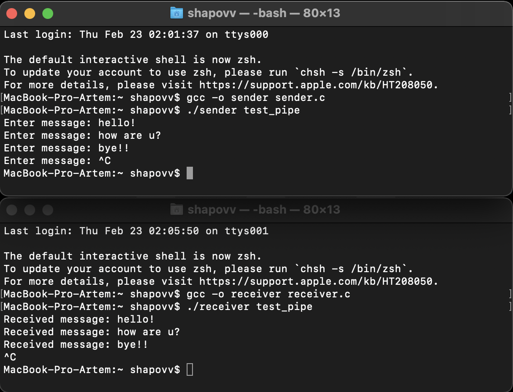

# ДР_5
## Шаповалов Артём | БПИ-217

**Задание**

Разработать программы, реализующие двусторонний обмен данными по именованным каналам. То есть организовать их взаимодействие как независимых процессов.

Опционально +2. Имена каналов для обмена сообщениями передавать через аргументы командной строки.

**Решение**

Реализованы две программы, [sender.c](sender.c) - для отправителя, [receiver.c](receiver.c) - для получателя. Имена каналов для обмена сообщениями передаваются через аргументы командной строки.

**Код программы для отправителя с соответствующими комментариями:**

```{c}
#include <stdio.h>
#include <stdlib.h>
#include <unistd.h>
#include <string.h>
#include <sys/types.h>
#include <sys/stat.h>
#include <fcntl.h>

int main(int argc, char *argv[]) {
    int fd;
    char buf[100];

    // Создаем именованный канал 
    mkfifo(argv[1], 0666);

    // Открываем канал для записи
    fd = open(argv[1], O_WRONLY);

    while (1) {
        // Запрашиваем сообщение у пользователя
        printf("Enter message: ");
        fgets(buf, sizeof(buf), stdin);

        // Отправляем сообщение в канал
        write(fd, buf, strlen(buf) + 1);
    }

    // Закрываем канал 
    close(fd);
    unlink(argv[1]);

    return 0;
}
```
**Код программы для получателя с соответствующими комментариями:**

```{c}
#include <stdio.h>
#include <stdlib.h>
#include <unistd.h>
#include <string.h>
#include <sys/types.h>
#include <sys/stat.h>
#include <fcntl.h>

int main(int argc, char *argv[]) {
    int fd;
    char buf[100];

    //Создаем именованный канал 
    mkfifo(argv[1], 0666);

    // Открываем канал для чтения
    fd = open(argv[1], O_RDONLY);

    while (1) {
        // Читаем сообщение из канала
        read(fd, buf, sizeof(buf));
        printf("Received message: %s", buf);
    }

    // Закрываем канал
    close(fd);
    unlink(argv[1]);

    return 0;
}
```
**Компиляция и запуск исполняемых файлов:**

Сначала важно скомпилировать и запустить программу отправителя, а затем получателя.

В первом окне терминала:
```{c}
gcc -o sender sender.c

./sender test_pipe
```
Во втором окне терминала:
```{c}
gcc -o receiver receiver.c

./receiver test_pipe
```
Где **test_pipe** - имя именованного канала. Для завершения работы используется комбинация **^C**.

**Пример работы программы:**


